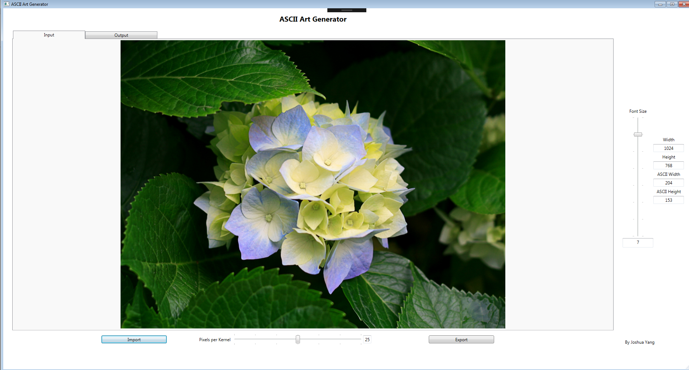
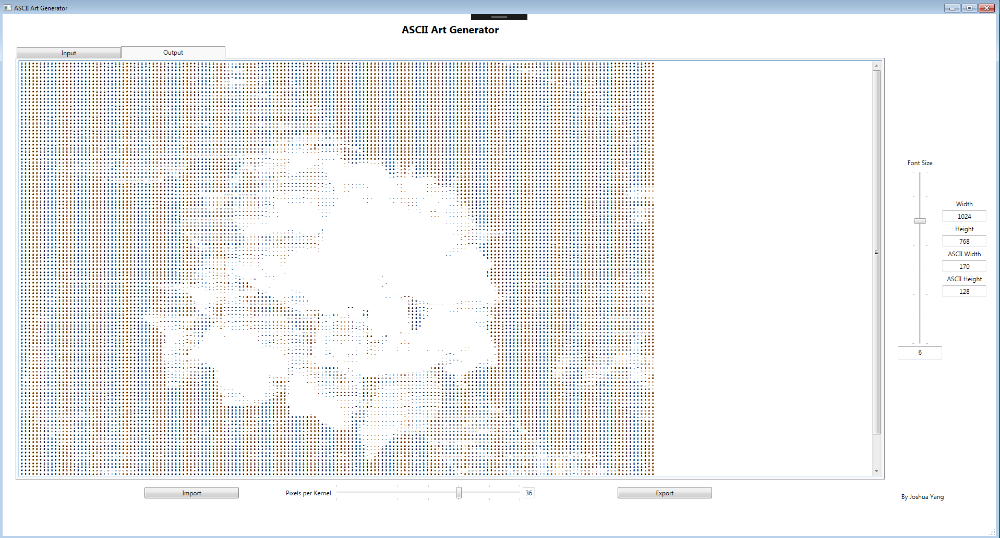

# ASCII_Art_Generator using WPF and C#
ASCII_Art_Generator developed for assessment for 'Intro to C#' course at AIE. 
Purpose of the assessment is to demonstrate the level of C# by creating a tool application. 
Major requirements required I/O file reading and implementing UI using any GUI. 

ASCII Art Generator can import any .jpg, .jpeg, .png files in to a ASCII character mapped out to 9 levels of grayscale value. 
You can also select different resolution by specififying the pixel per kernal value using the slider. 
Also, zoom slider and size data is implemented on the right. 
Once you find the ASCII art you want you can also export the art to a .txt file. 

## How to Use

Click the Import button to open up file dialog and select a image you want to convert 
The image will be loaded into the preview in the Input tab and its Width and Height is displayed on the right 

Click on the Output tab to look at the generated ASCII art 
Change the value of Pixels per Kernel slider at the bottom to change the ASCII art resolution 
Change the value of Font Size slider on the right to zoom in or out 
Click on the Export button the export the ASCII art to .txt 
The application will automatcially open the .txt you saved 

## How it Works
1. Import an image from a file
2. Convert the image to grayscale
3. Analyze each pixel color according to the resolution
4. Convert the pixel color data into ASCII Character
5. Print out the coverted ASCII art image
6. Export it to a .txt

