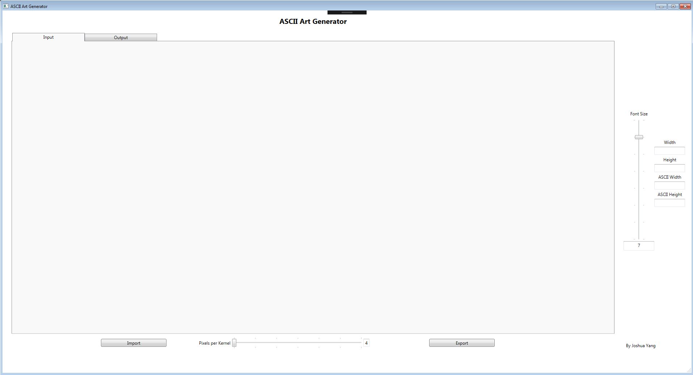

# ASCII_Art_Generator
ASCII_Art_Generator WPF C# Tools Development

## How to Use

Import an image

Choose the resolution you want

Export it out to a .txt

## How it Works
1. Imports an image from a file
2. Convert the image to grayscale
3. Analyze each pixel color data according to the resolution
4. Convert the pixel data into ASCII Character
5. Print out the coverted ASCII art 
6. Export it to a .txt

